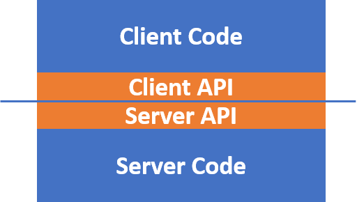

# cgapis: Code Generation from API Specification
`cgapis` generates code client-side and server-side from API specification files.

## Installation and Usage
```bash
npm install -g cgapis # install globally to use from any directory
```

Start by copying the two directories `/api-schemas` and `/api-services`, then run:
```bash
cgapis
```

## Other Options
```
Usage: cgapis [options] [command]

Generates client-side & server-side code from API specification files

Options:
  -V, --version                       output the version number
  -p, --schemas-dir <path>            Directory of API Schemas
  -P, --services-dir <path>           Directory of API Services
  -a, --api-version <version>         API Version
  -S, --server-dir <path>             Directory for the generated server-side code
  -C, --client-dir <path>             Directory for the generated client-side code
  -c, --client-lang <lang-framework>  client language and framework
  -s, --server-lang <lang-framework>  server language and framework
  -h, --help                          output usage information
```

## Table of Contents
- [cgapis: Code Generation from API Specification](#cgapis-code-generation-from-api-specification)
  - [Installation and Usage](#installation-and-usage)
  - [Other Options](#other-options)
  - [Table of Contents](#table-of-contents)
  - [Features](#features)
    - [Specifications](#specifications)
    - [Great Development Experience](#great-development-experience)
    - [Robust Error-Handling](#robust-error-handling)
  - [Workflow](#workflow)
    - [1. Initial Definition](#1-initial-definition)
    - [2. Code Generation](#2-code-generation)
    - [3. Later Definition Changes](#3-later-definition-changes)
  - [Solution Details](#solution-details)
  - [How it Happens](#how-it-happens)
  - [Problems Addressed](#problems-addressed)
    - [1. Client & Server Mismatch](#1-client--server-mismatch)
    - [2. REST is Not Enough](#2-rest-is-not-enough)
    - [3. HTTP Status Codes Are Not Enough](#3-http-status-codes-are-not-enough)
    - [4. Boilerplate Code = Silly Errors](#4-boilerplate-code--silly-errors)
- [Supported Languages](#supported-languages)
- [Contribution](#contribution)
    - [Some of the few things you can help with:](#some-of-the-few-things-you-can-help-with)
    - [Remember](#remember)


## Features
### Specifications
- A contract between frontend and backend developers. A single source of truth for the API
- Language independent (see: [Supported Languages](#supported-languages))
- Server and clients are always synchronized. No more manual changes to every client when you update your server API
### Great Development Experience
- Deal with methods directly. Low-level primitives such as URL endpoints, HTTP methods, request body, query strings, URL encoding, ...etc are abstracted away
- Auto-completion
- Static error detection
- Type checking
- Documentation
### Robust Error-Handling
- Errors are defined so that none escapes checking
- Data Validation
  - Before requests leave the client and when requests reach the server
  - Using off-the-shelf [JSON Schema](http://json-schema.org/) validators (e.g., [Ajv](https://github.com/epoberezkin/ajv) in case of JavaScript)


## Workflow

### 1. Initial Definition
Developers agree to define:
- Services in `/api-services` a namespace for operations
- Schemas in `/api-schemas` defined using [JSON Schema draft-07](http://json-schema.org/)
- Service operations defines the structure of the request (`req`) and response (`res`)

### 2. Code Generation
Then, you `cd` into the directory where `/api-services` and `api-schemas` exist, and run the command `cgapis`. You'll see the output as two directories: `/generated-client` and `/generated-server`.

### 3. Later Definition Changes
If you make changes to services or schemas and want to add those changes, then, you'll have to use the `diff` subcommand, which doesn't work right now. `diff` should take two versions of services and/or two versions of schemas and outputs the difference: i.e., additions and deletions.


## Solution Details
- Let the user deal with the API directly, calling methods, and getting return values
- Abstracting away the low-level primitives such as URL endpoints, HTTP methods, request body, query strings, URL encoding, ...etc
- The user will still have low-level control



- A request to the server is like passing parameters to a function
- A response from the server is like the return value from the function

## How it Happens
- Call (Request):
    1. **Client** calls **API**
    2. **API** calls **API**
    3. **API** calls **Server**
- Return (Response):
    1. **Server** returns to **API**
    2. **API** returns to **API**
    3. **API** returns to **Client**

- Only **Client** and **Server** contain your code

## Problems Addressed
### 1. Client & Server Mismatch
REST over HTTP doesn't gaurantee API synchronization between the server and the clients. Changes made to the API on the server have to be reflected at each client. This is done manually, which wastes time, and is boring. We can automate that. Also, the API has to be clearly defined and agreed upon by both client-side and server-side developers. This eliminates any conflicts that would otherwise arise later on.

### 2. REST is Not Enough
RESTful isn't an agreed upon standard. Everybody has his own "standard", opinions, and "best practices". HTTP verbs aren't enough to express all functionalities of the web service, if your logic isn't just about GET, POST, PUT, PATCH, DELETE. For example, let's say I have a `Course` Collection/Table, which contains a curriculum, which is an array of `Sections` and within each section is an array of `Nodes` which contain the content of the course, i.e., the learning material.

Now, how would you map the following to HTTP verbs?:
1. Reorganize sections or nodes
2. Increment views on a node
3. Increment/Decrement likes/dislikes on a course
4. Add a comment to a node

Developers' views would vary, simply because there are many ways to do it. Wouldn't it be more practical to just call `Course.dislike(courseID, userID)`, or `Node.addComment(nodeID, comment)`, and have the IDE help?

### 3. HTTP Status Codes Are Not Enough
HTTP status codes are predefined generic messages. Trying to communicate through status codes is a futile endavor. Instead, we can define application specific status codes (error codes, specifically) that make sense to the client, and are discoverable through auto-completion. Afterall, robust systems are designed to handle all errors, and to handle them well. That means clients know what errors servers might return, and handle each error accordingly, leaving no errors unhandled!.

### 4. Boilerplate Code = Silly Errors
Alot of code on the client side to make requests to specific URLs is repetetive and prone to error, because there is no automatic checker that tells us whether we made a mistake in the URL, or how the parameter names are not right, or any other detials. We can solve this problem. We can generate this low-level code, so that you can focus on actual application logic.


# Supported Languages
| Language           | Frameworks |
|--------------------|------------|
| Typescript (Node)    | Express.js |
| Typescript (Browser) | Axios      |
| ...                | ...        |
| ...                | ...        |

# Contribution
Start by copying a file from `/generator/client` or `/generator/server` and change the code inside the `generate()` function. The following is a table showing what each file/directory is for:

|File / Directory                    |Description                                                                                    |
|---------------------|--------------------------------------------------------------------------------------------------------------|
|`index.js`             |Main entry                                                                                                    |
|`config.js`            |Configuration                                                                                                 |
|`cmd.js`               |Command-Line Interface (overwrites config)                                                                    |
|`spec.js`              |Exports `{schemas, services}` after reading and parsing `/api-schemas` and `/api-services`                    |
|`/generator/client`    |Implementation of client generators. Must export the method generate                                          |
|`/generator/server`    |Implementation of server generators. Must export the method generate                                          |
|`/generator/*-utils.js`|Helper functions used for, say, javascript generators specifically                                            |
|`/generator/utils.js`  |Helper functions used across all types of generators (not specific to any language)                           |
|`/types-generator`     |Used by files in `/generator/client` and `/generator/server` to generate types for some languages, like typescript|
|`/formatter`           |Used by files in `/generator/client` and `/generator/server` to format generated code                             |

### Some of the few things you can help with:
- Support more languages
    - [ ] Go
    - [ ] Python
    - [x] typescript-express
    - [x] typescript-axios
    - [ ] ...
- [ ] Write tests for this source code
- [ ] Write the `diff` subcommand
- [ ] Generate API test stubs (maybe)
- [Suggest ways to improve](https://github.com/HassanAlgoz/cgapis/issues)
- Use, and [raise issues](https://github.com/HassanAlgoz/cgapis/issues)

### Remember
- The solution shall not make anything harder to do (e.g., access control, error-handling, logging, or validation). Only easier and simpler
- The solution shall adapt to changes in API specs
- The solution shall be easily customized to users' needs