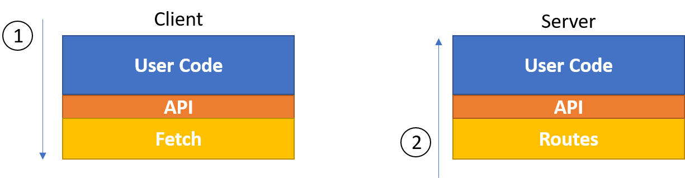

# Code Generation From API Specification
Code generated for both client- and server-side. **Note**: The project is still in early stages.

## Install
```bash
npm install -g cgapis
```

## Usage
```bash
cgapis --spec api.json
```

Generates this:
```
└───generated
    ├───client
    └───server
        └───api
```

## Other Options
```bash
--server-dir  ./generated/server  \
--client-dir  ./generated/client  \
--api-version v1                  \
--client-lang javascript          \
--server-lang javascript
```

## A Solution to These Problems
### 1. Client & Server Mistmatch
REST over HTTP doesn't gaurantee API synchronization between the server and the clients. Changes made to the API on the server have to be reflected at each client. This is done manually, which wastes time, and is boring. We can automate that. Also, the API has to be clearly defined and agreed upon by both client-side and server-side developers. This eliminates any conflicts that would otherwise arise later on.

### 2. REST is Not Enough
RESTful isn't an agreed upon standard. Everybody has his own "standard", opinions, and "best practices". HTTP verbs aren't enough to express all functionalities of the web service, if your logic isn't just about GET, POST, PUT, PATCH, DELETE. For example, let's say I have a `Course` Collection/Table, which contains a curriculum, which is an array of `Sections` and within each section is an array of `Nodes` which contain the content of the course, i.e., the learning material.

Now, how would you map the following to HTTP verbs?:
1. Reorganize sections or nodes
2. Increment views on a node
3. Increment/Decrement likes/dislikes on a course
4. Add a comment to a node

Developers views on this would vary, simply because there are many ways to do this. My point is, don't bother. Besides, wouldn't it be more practical to deal with methods on objects directly?.

### 3. HTTP Status Codes Aren't Expressive
HTTP status codes are predefined generic messages. Trying to communicate through status codes is a futile endavor. Instead, we can define application specific status codes (error codes, specifically) that make sense to the client, and are discoverable through auto-completion. Afterall, robust systems are designed to handle errors well. That means clients know what errors servers might return, and handle each error accordingly, leaving no errors unhandled!.

### 4. Boilerplate Code
Alot of code on the client side to make requests to specific URLs are just repetetive and prone to error, because there is no automatic checker that tells us whether we made a mistake in the URL, or how the parameter names are not right, or any other detials. We can solve this problem. And we can let the computer write this low-level code for you.

## "What about Swagger?" you might ask
Swagger "helps developers design, build, document, and consume RESTful Web services". It has a code generator for Javascript and Node.js. But, I have problems with Swagger. its code is unmaintained and so the generated code is old, which also makes it hard to use. I don't like their way of instantiating objects and using AMD. Also, the generated API is not typed. Finally, Swagger's API specification files include more details than I care about. I don't care about the specific URLs and where they are, and I don't care what HTTP status codes are returned because I don't think HTTP's verbs and status codes are expressive enough.

Besides, I want to roll out my own generator, because I want to explore something new.

## Solution
### Code Generation From API Specification
Abstract the low-level code, and write the required boilerplate code. Let the user deal with the API directly, calling methods, and getting return values, as if doing RPC. Just write `api.json`, a declaration of the API in terms of **services** and **data**, much like **methods** and **parameters**. Abstracting away the low-level primitives such as URL endpoints, HTTP methods, request headers and body, query strings, ...etc.



- A request to the server is like passing parameters to a function
- A response from the server is like the return value from the function

## `api.json`
Currently, the JSON file is formatted like so:
- `services`: like namespaces. For organizing operations together
- `ops`: methods/functions in a service
- `req`: describes function parameters. (`req` is short for request)
- `res`: describes function return values. (`res` is short for response)
- `refs`: defines user-defined data types (yet to be implemented)

**Note:** because this is under development, many things, including the format of the JSON file, are subject to change.

## Imposed Requirements
- The solution shall not make anything harder to do (e.g., access control, error-handling, logging, or validation). Only easier and simpler.
- The solution shall adapt to changes in api specs. (see the `diff` tool)
- The solution shall be customizable to users' needs. (client language, server language, maybe frameworks, ..etc)


## Extra
### Validation
It is redundant to do validation both client- and servers-side. We can solve this problem by defining our data types once, and have the program generate all the runtime validation code required. The `ajv` (Another JSON Schema Validator) library would be used for validating schemas. The library implements the JSON-Schema standard, which makes it interoperable with other libraries as well. Custom validation code is a concern that we'll try to address as well.